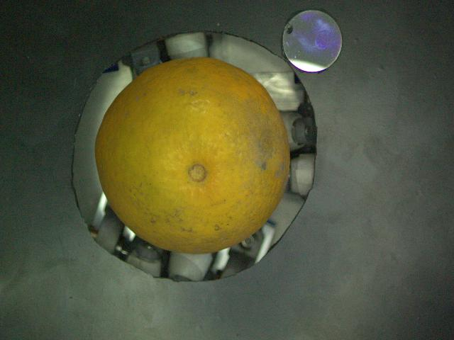
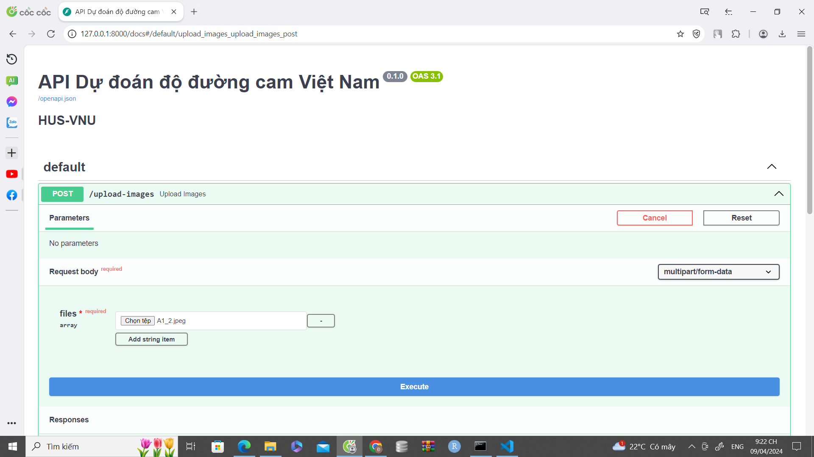
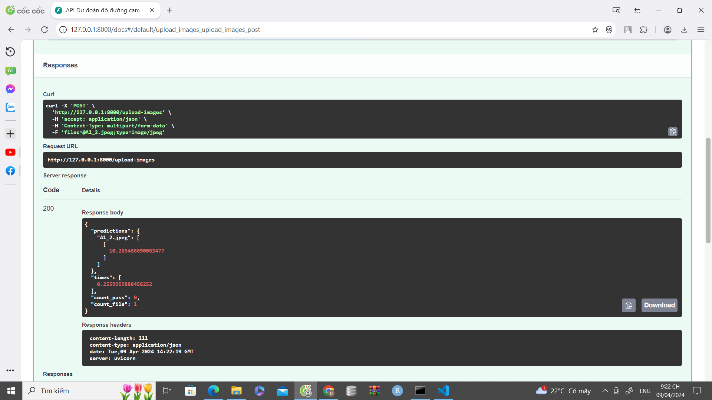

Tạo một folder đặt tên là configs và để các model vào đó!

[doaw load model from here ](https://drive.google.com/drive/folders/1AXOT72URLVdg6kTIm3d0Iq6-EYi6Q8Sd?usp=sharing)

# Predicting orange sugar from images

Note: đầu vào của api có thể cho vào nhiều ảnh hoặc nén vào 1 file zip và upload 1 lần !


Dưới đây là một ví dụ README hướng dẫn chạy API này:

# Hướng dẫn chạy API

## Cài đặt

1. Cài đặt Python (phiên bản 3.7 trở lên).

2. Cài đặt các thư viện cần thiết bằng lệnh sau:

   ```bash
   pip install requirements.txt
   ```

## Chạy API

1. Clone repository từ GitHub:

   ```bash
   git clone https://github.com/Nguyendai202/Predicting-orange-sugar-from-images.git
   ```

2. Di chuyển vào thư mục chứa mã nguồn:

   ```bash
   cd your-repo
   ```

3. Chạy API bằng lệnh sau:

   ```bash
   python main.py
   ```

4. API sẽ chạy trên `http://127.0.0.1:8000`.

   
   

5. Sau khi ấn Choose File, nhập file của bạn vào và ấn Execute thì lướt xuống dưới sẽ có kết quả ở đây
   



### Request

- Phương thức: POST
- Endpoint: `http://127.0.0.1:8000/upload-images`
- Header: không yêu cầu
- Body:
  - Loại: form-data
  - Key: `image`


### Response

Loại: type dict


